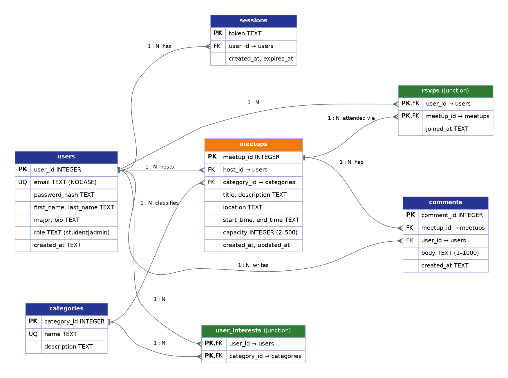

# MyCampus Database Design

**Engine:** SQLite 3, accessed from Node.js with `better-sqlite3`.
**Schema file:** [`src/db/schema.sql`](../src/db/schema.sql). It is applied automatically every time the server starts.

## What the app needs to store

- **Students:** account, login and profile details.
- **Login sessions:** so a user stays logged in between page loads.
- **Categories:** the kinds of meetups, such as Study Group, Fitness and Hobbies.
- **Meetups:** who is hosting, what it is, and where and when it happens.
- **Attendance:** which students are going to which meetups.
- **Discussion comments** on each meetup.
- **Interests:** which categories each student cares about.

## Entity Relationship Diagram

The source is [`erd.dot`](erd.dot). Re-render it with `dot -Tpng docs/erd.dot -o docs/erd.png`.

## Tables

| Table | Purpose | Primary key | Foreign keys |
|---|---|---|---|
| `users` | Student accounts and profiles | `user_id` | none |
| `sessions` | Login tokens (7-day expiry) | `token` | `user_id → users` (CASCADE) |
| `categories` | Lookup list of meetup types | `category_id` | none |
| `meetups` | Events hosted by students | `meetup_id` | `host_id → users` (CASCADE), `category_id → categories` (RESTRICT) |
| `rsvps` | Who is attending what (many-to-many) | (`user_id`, `meetup_id`) | `user_id → users`, `meetup_id → meetups` (both CASCADE) |
| `comments` | Discussion posts on a meetup | `comment_id` | `meetup_id → meetups`, `user_id → users` (both CASCADE) |
| `user_interests` | Student ↔ category interests (many-to-many) | (`user_id`, `category_id`) | `user_id → users`, `category_id → categories` (both CASCADE) |

## Relationships

- **User 1 : N Meetup.** A student can host many meetups, and each meetup has exactly one host.
- **Category 1 : N Meetup.** Every meetup belongs to one category.
- **User M : N Meetup** (attendance), resolved by the `rsvps` junction table.
- **Meetup 1 : N Comment** and **User 1 : N Comment.**
- **User M : N Category** (interests), resolved by the `user_interests` junction table.
- **User 1 : N Session.**

## How the structure supports MyCampus features

| Feature | Tables / query |
|---|---|
| Browse meetups | `meetups JOIN categories JOIN users`, with a sub-query that counts `rsvps` for "x / capacity going" |
| Filter by category | `WHERE m.category_id = ?` (indexed) |
| Upcoming vs past | `WHERE m.end_time >= now` (indexed on `start_time`) |
| Join a meetup | `INSERT INTO rsvps`. The composite PK stops a student joining twice. |
| "My meetups" page | `meetups WHERE host_id = ?` and `meetup_id IN (SELECT meetup_id FROM rsvps WHERE user_id = ?)` |
| Delete a meetup | One `DELETE`. `ON DELETE CASCADE` removes its RSVPs and comments automatically. |
| Stay logged in | Cookie token → `sessions JOIN users` |

## Handling duplicate, missing and invalid data

Protection works at two levels. The API validates input first and returns friendly messages. The database enforces its own constraints as a safety net.

| Problem | Backend validation (added with the API) | Database constraint |
|---|---|---|
| Duplicate account | Email is lower-cased; checked first; returns 409 | `email UNIQUE COLLATE NOCASE` |
| Joining a meetup twice | Checked first; returns 409 "already joined" | `PRIMARY KEY (user_id, meetup_id)` |
| Duplicate interest | `new Set()` removes repeated ids | `PRIMARY KEY (user_id, category_id)` |
| Duplicate category on restart | none | `name UNIQUE` + `INSERT OR IGNORE` |
| Missing required fields | Field-level 400 errors | `NOT NULL` + `CHECK (length(trim(x)) ...)` |
| End before start | 400 on `end_time` | `CHECK (end_time > start_time)` |
| Unrealistic capacity | 400: must be 2–500, and not below current attendees | `CHECK (capacity BETWEEN 2 AND 500)` |
| Unknown category / user | 400 "category does not exist" | `FOREIGN KEY` (enabled with `PRAGMA foreign_keys = ON`) |
| Deleting a category that is in use | none | `ON DELETE RESTRICT` |
| Orphaned RSVPs/comments | none | `ON DELETE CASCADE` |
| Over-full meetup | Capacity checked inside a transaction | none |
| Passwords | 8+ chars, with a letter and a number | Stored only as a salted scrypt hash |
| Invalid role | none | `CHECK (role IN ('student','admin'))` |

The database constraints apply on their own, even when no backend is running. `tests/db.test.js` checks them.

Proof that each constraint works, with real queries run against the database: [`evidence/sample-queries.txt`](evidence/sample-queries.txt).

## Design decisions and changes

These are the main choices that moved the design away from a simpler first idea of "one table per page".

1. **Categories became a lookup table instead of free text.** Free-text categories allowed "study", "Study Group" and "studying" as separate values, which broke filtering. A `categories` table with a UNIQUE name and a foreign key from `meetups` keeps the labels consistent.
2. **Added the `rsvps` junction table instead of storing attendees in a column.** A comma-separated list can't be counted, joined or protected against duplicates. A composite primary key can.
3. **Added `user_interests`** so profiles can list interests. It uses the same junction-table pattern.
4. **Sessions are stored in the database, not in server memory.** Logins survive a server restart, and deleting a user cascades to their sessions.
5. **Turned on `PRAGMA foreign_keys = ON`.** SQLite ignores foreign keys unless this is set on every connection. It is set in `src/db/index.js`, and a test checks it.
6. **Stored times as `YYYY-MM-DDTHH:MM` text.** This matches the HTML `datetime-local` input exactly, so values sort and compare correctly as strings (`end_time > start_time`).
7. **Added indexes** on `meetups(start_time)`, `meetups(category_id)`, `meetups(host_id)`, `rsvps(meetup_id)`, `comments(meetup_id)` and `sessions(user_id)` for the most frequent queries.
